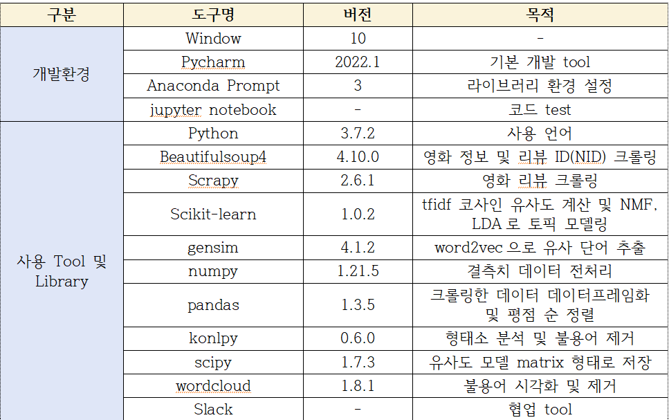

 # 키워드를 활용한 사용자 리뷰 기반 네이버 영화 추천시스템 Popcorn!
 
 ### 기간  
 2022.3.30.~2022.4.8.  
 
 ### 내용   
 네이버의 영화 정보와 장문 리뷰들을 크롤링한 후 word2vec,tfidf,Django를 활용한 영화 추천 웹 페이지 구현
 
 ### 상세 과정
 
 1. 네이버 영화 페이지에 있는 영화 정보(Beautifulsoup4)와 블로그 리뷰(Scrapy)를 크롤링 
 2. wordcloud, okt를 사용해 불용어 제거 
 3. 크롤링한 리뷰들에 word2vec과 tfidf를 사용해 코사인 유사도 모델링 
 4. 토픽 모델링 기법인 LDA와 NMF를 각각 사용해 군집화 
 5. Django로 키워드 검색 페이지를 생성해 기본(word2vec), NMF, LDA 별로 영화 검색 페이지 구현 
 6. 검색시 영화 평점 순으로 영화 정렬
 
 ### 사용 기술 stack
 
 

### 인원 및 역할
- 총원 4명 
- 역할 : 영화 정보 크롤링, 웹 페이지 구현

### 상세 역할
**< part (1) : 영화 정보 크롤링 >**    
- beautifulsoup4 활용 영화 제목, 감독, 개봉정보, 줄거리 등 10개 정보 크롤링(2011~2019)
- 크롤링 한 데이터 csv 형태로 Django 자체 db에 저장  

**< part (2) : 웹 페이지 구현 >**  
- django 활용 키워드 검색 추천 웹 페이지 구현  

## 프로젝트 결과

### 개선 사항
- 검색시 속도 문제 해결 필요
- 웹 서버 배포를 통해 홈페이지 구현
- 키워드 기반 추천 방식 외에 다른 추천 시스템 방식 도입 
